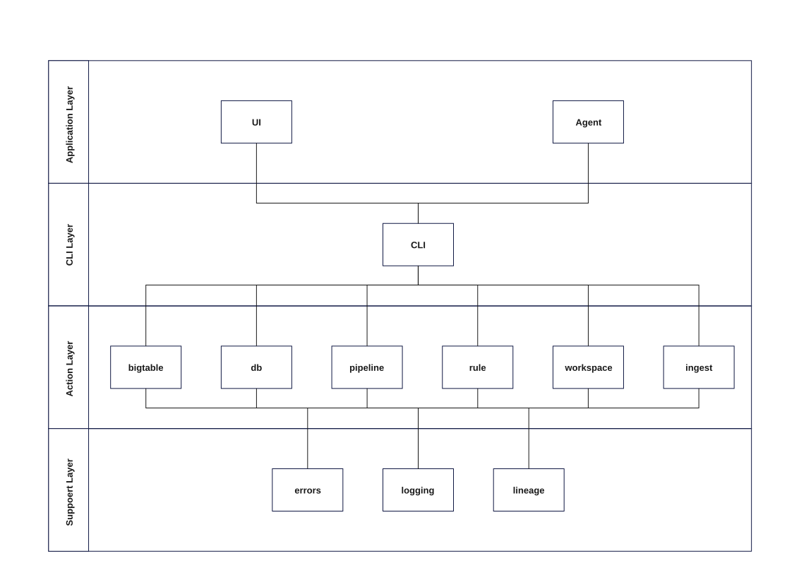
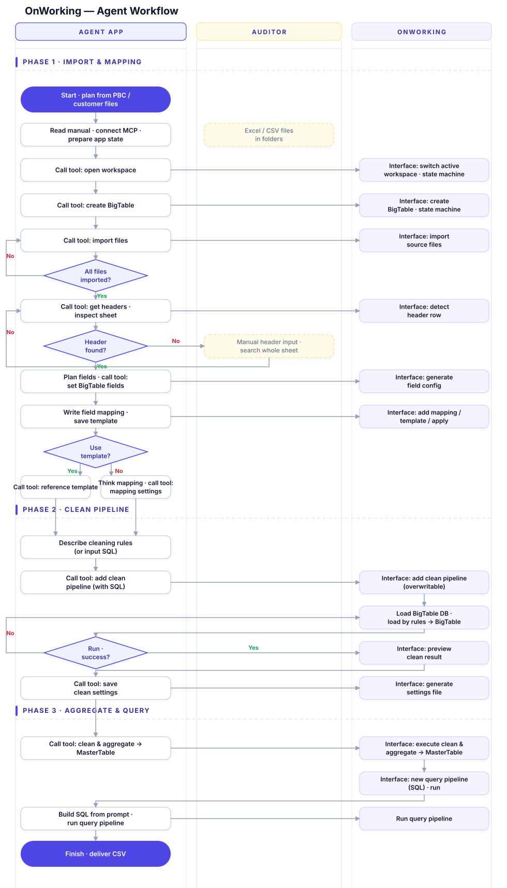
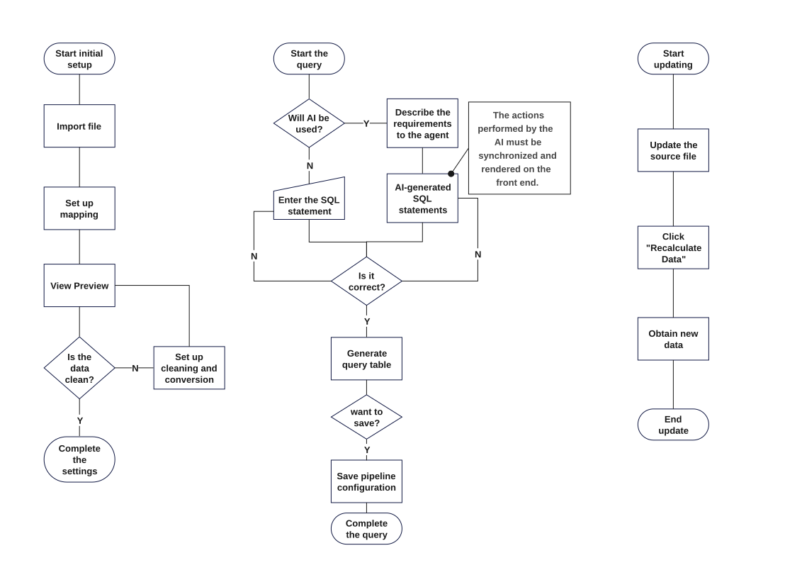

<div align="center">

# OnWorking

**A transparent, rule-driven framework for AI-native data work.**

Turn scattered Excel / CSV files into clean, queryable tables — and let an AI agent
do it for you through a governed, fully traceable command surface.

[](LICENSE)


[English](README.en.md) · [简体中文](README.md)

</div>

---

## System architecture

OnWorking is a layered desktop application. A **CLI hub** sits between the
user-facing **Application Layer** — the UI and the AI Agent — and the **Action
Layer**, which contains the BigTable, database, pipeline, rule, workspace, and
ingest engines. A **Support Layer** provides errors, logging, and row-level
lineage for every action.



## Why OnWorking?

Financial and business data arrives as dozens of similarly-structured Excel files
scattered across folders. Cleaning, merging, and reconciling them by hand is slow
and error-prone — and once the numbers are combined, nobody can trace a figure
back to the file it came from.

OnWorking approaches both problems from the ground up:

- **Rules, not scripts.** Each file and sheet is processed by a declarative YAML
  rule and explicit SQL pipelines. Everything is plain text — reviewable by
  humans, readable and auditable by AI tools.
- **Lineage on every row.** Every merged row keeps its origin:
  `__source_file`, `__source_sheet`, `__source_row`, `__extracted_at`. No more
  "where did this number come from?"
- **AI-native operation.** OnWorking ships an MCP server and a CLI, so an AI agent
  can run the whole workflow itself — through a strict, documented command
  surface. You stay in control; the machine does the heavy lifting.

## Features

| | |
|---|---|
| 🧾 **Rules, not scripts** | Declarative YAML rules map source columns to table fields; cleaning & transformation happen in explicit SQL pipelines. |
| 🧬 **Row-level lineage** | Every merged row carries `__source_file` · `__source_sheet` · `__source_row` · `__extracted_at` — always traceable. |
| 🔀 **Two-stage pipeline** | Files land in per-folder **BigTables**, then aggregate into a single workspace **MasterTable** — the final queryable database. |
| 🤖 **AI agent + MCP** | A JSON-RPC MCP server exposes the whole command surface as tools; agents operate workspaces end-to-end. |
| ⌨️ **CLI / NDJSON** | Drive everything from the terminal with line-delimited commands — scriptable, pipeable, auditable. |
| 🗂️ **Folders as tables** | Drop same-format files into a folder; one pipeline merges them into a single table. |
| 📋 **SQL workbench** | Browse tables, run queries against the MasterTable, and export clean CSV (UTF-8 BOM so Excel opens Chinese correctly). |
| 📚 **Templates** | Save a field mapping once, apply it to every file in a BigTable with one click. |

## How it works

### Two-stage pipeline

```
      ① clean · rule YAML                ② sql-clean · SQL               ③ query · SQL
┌─────────────────────┐   ┌──────────────────────────┐   ┌──────────────────────┐
│  Source files       │──▶│  BigTable DB (per folder) │──▶│  MasterTable         │──▶ Query results / CSV
│  Excel / CSV        │   │  .onworking/bigtables/…   │   │  master.db           │
└─────────────────────┘   └──────────────────────────┘   └──────────────────────┘
```

1. **Clean** — source files flow through their rule YAML into a per-folder
   **BigTable**, with lineage columns attached to every row.
2. **Aggregate** — a `sql-clean` pipeline runs SQL over each BigTable (dropping
   subtotal/signature rows, deriving month columns, …) and aggregates everything
   into the workspace **MasterTable** (`master.db`).
3. **Query** — run SQL against the MasterTable, preview results, and export CSV.

### Agent workflow

An AI agent can run the entire workflow itself — opening a workspace, creating
BigTables, importing files, detecting headers, writing field mappings, building
clean pipelines, aggregating to the MasterTable, and running queries — through
MCP tools backed by a strict command contract. Every tool call goes through the
app, never around it.



### User flows



## Core concepts

| Concept | Meaning |
|---|---|
| **Workspace** | The root directory for your data: `source/` for raw files, `.onworking/` for rules, pipelines, settings, and the SQLite database. |
| **BigTable** | A folder that defines one output table (`settings.json` = table name, columns, primary key) with its own `source/` folder and rule state. |
| **Source file** | An Excel or CSV file placed in a BigTable's `source/` directory. |
| **Rule** | A YAML file describing how one file × sheet maps into the table: sheet, header row, cutoff row, field mapping. |
| **Pipeline** | A named, versionable unit of work — `clean`, `sql-clean`, or `query` — with a `kind`, a SQL body, and dependencies. |
| **MasterTable** | The final queryable database (`master.db`) produced by aggregating every BigTable through `sql-clean` pipelines. |
| **Lineage** | `__source_file` / `__source_sheet` / `__source_row` / `__extracted_at` — attached to every row, everywhere. |

## Quick start

### Requirements

- Node.js 18 or newer

### Run in development

```bash
npm install
npm start
```

This builds the main process, starts the Vite dev server, and launches Electron.

### Package installers

```bash
npm run dist
```

Output goes to `release/` (NSIS installer on Windows, DMG on macOS, AppImage on
Linux). Native SQLite is built for both ABIs so the packaged app and the CLI
work whichever way they're launched.

### CLI & MCP

```bash
# NDJSON command stream — line-delimited requests on stdin, responses on stdout
printf '%s\n' \
  '{"reqId":1,"cmd":"workspace.open","path":"D:/path/to/workspace"}' \
  '{"reqId":2,"cmd":"state.summary"}' | npm run onw -- open D:/path/to/workspace

# MCP server over stdio (JSON-RPC 2.0) — start without a path; agents call workspace.open
npm run onw -- mcp
```

The CLI understands `workspace.*`, `bigtable.*`, `mapping.*`, `pipeline.*`,
`setup.*`, `query.*`, `template.*`, `schema.*`, `state.*` and `vcs.*` commands.

### Tests & typecheck

```bash
npm test
npm run typecheck
```

## A typical workflow

1. **Open a workspace** — pick a folder that will hold all your data.
2. **Create a BigTable** — configure its name, columns (text / amount-cents /
   number / date), and optional primary key.
3. **Add source files** — drop `.xlsx` / `.xls` / `.csv` files into the
   BigTable's `source/` folder.
4. **Write a rule** — for each file × sheet, detect the header row and map each
   column to a table field. Save it as a template to reuse later.
5. **Run the clean pipeline** — all source files flow through their rules into
   one BigTable, keeping row-level lineage.
6. **Run the sql-clean pipeline** — aggregate every BigTable into the workspace
   MasterTable.
7. **Query & deliver** — explore the data in the SQL workbench, or export clean
   CSV straight from the MasterTable.

## Rule format

Rules are YAML files stored in each BigTable's `.onworking/rules/` folder:

```yaml
name: rule_voucher_1
display: "Voucher book"
version: 1
sources:
  - pattern: "**/voucher.xls"   # glob matched against the folder's source/
    sheetIndex: 0
    headerRow: 1                # 1-based row that holds the header
    endRow: 10374               # 1-based cutoff row (omit = read to the end)
fields:
  - sourceHeader: DATE          # column in the source file
    outputName: date
    included: true
    order: 1
  - sourceHeader: AMOUNT        # column in the source file
    outputName: amount
    included: true
    order: 2
mergeStrategy:
  mode: append
```

## Project structure

```
onworking/
├── src/
│   ├── cli/                    # NDJSON command surface (CLI / MCP transport)
│   ├── core/
│   │   ├── agent/              # AI agent flow & tool registry
│   │   ├── bigtable/           # BigTable schema & store
│   │   ├── db/                 # SQLite (better-sqlite3, worker + WAL)
│   │   ├── etl/                # ETL transform & writer
│   │   ├── ingest/             # file scanner, parser, header detection
│   │   ├── lineage/            # row-level lineage graph
│   │   ├── pipeline/           # clean / sql-clean / query pipeline engine
│   │   ├── rule/               # YAML rule store & compiler
│   │   ├── state/              # project state
│   │   ├── template/           # mapping templates
│   │   ├── versioning/         # workspace VCS (git)
│   │   └── workspace/          # workspace lifecycle & settings
│   ├── ipc/                    # main ↔ renderer contracts & handlers
│   ├── main/                   # Electron main process + CLI bridge
│   ├── mcp/                    # MCP server (JSON-RPC 2.0) + manual
│   └── renderer/               # React UI (BigTable / mapping / pipeline / preview / SQL views)
├── scripts/                    # build & diagram tooling
└── tests/                      # integration tests (vitest)
```

## Tech stack

| Layer | Technology |
|---|---|
| Desktop shell | Electron 31 |
| UI | React 18 · TypeScript 5.6 |
| Bundler / dev server | Vite 6 |
| Database | SQLite via better-sqlite3 (dual-ABI, worker thread + WAL) |
| Excel / CSV parsing | SheetJS (`xlsx`) |
| Rule storage | YAML (`js-yaml`) |
| AI integration | MCP server (JSON-RPC 2.0) · NDJSON CLI |
| Packaging | electron-builder (NSIS / DMG / AppImage) |
| Testing | Vitest |

## License

Licensed under the [Apache License 2.0](LICENSE).
