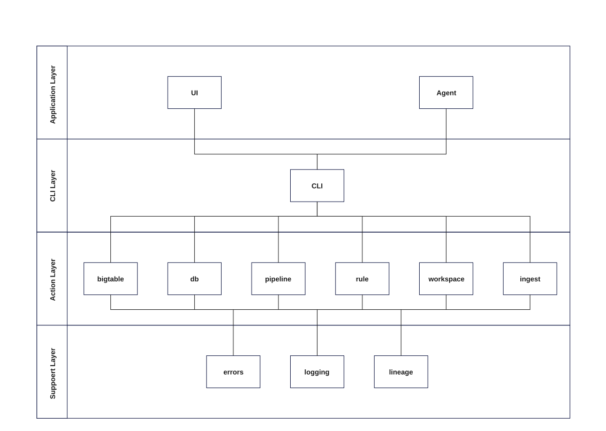
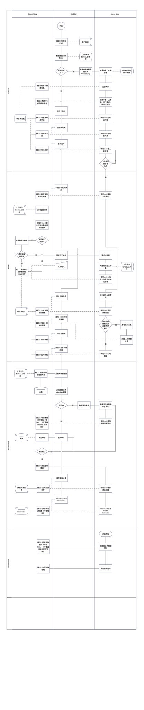
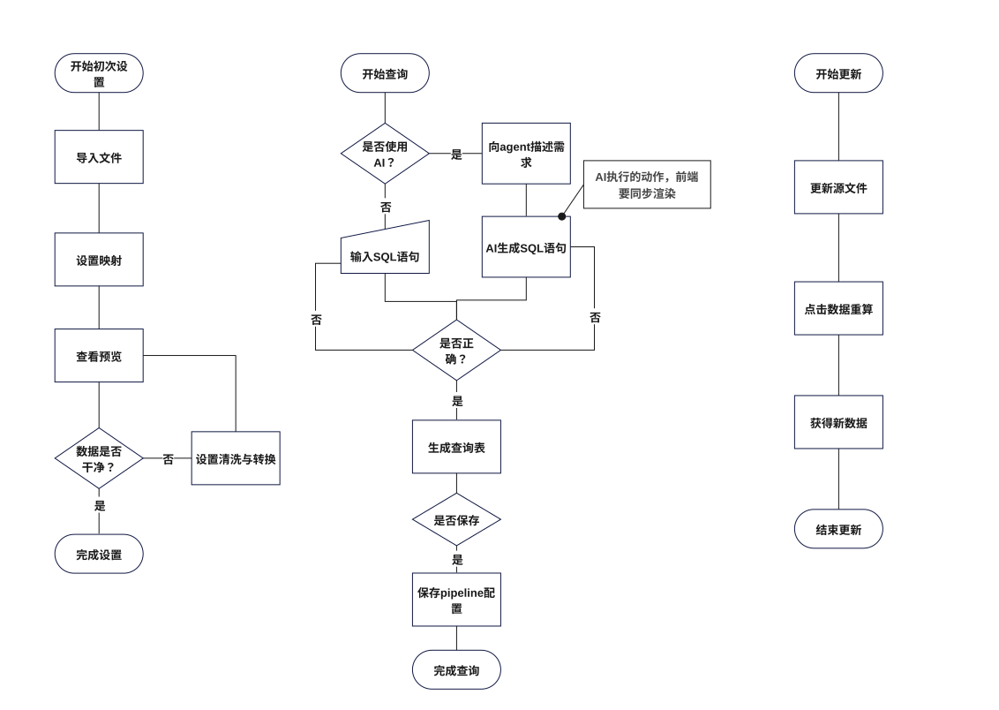

<div align="center">

# OnWorking

**一个透明、规则驱动的 AI 原生数据工作框架。**

把散落的 Excel / CSV 文件整理成干净、可查询的数据表——并且让 AI Agent 通过一套受管控、完全可追溯的命令面替你完成这一切。

[](LICENSE)


[English](README.en.md) · [简体中文](README.md)

</div>

---

## 系统架构

OnWorking 是一款分层桌面应用。**CLI 中枢**位于面向用户的**应用层**（界面 UI 与 AI Agent）与**动作层**（大表、数据库、管线、规则、工作区、导入等引擎）之间；**支撑层**为每个动作提供错误处理、日志与行级血缘。



## 为什么选择 OnWorking？

财务和业务数据常常以几十个结构相似的 Excel 文件散落在各个文件夹里。手工清理、合并、对账既慢又容易出错——而且一旦数字被合并，没人能再把某个数字追溯回它来源的文件。

OnWorking 从根本上同时解决这两个问题：

- **用规则，而不是脚本。** 每个文件/工作表由一个声明式的 YAML 规则和显式的 SQL 管线处理。所有东西都是纯文本——人类可审阅，AI 工具也可读、可审计。
- **每一行都有溯源。** 每个合并后的行都保留来源：`__source_file`、`__source_sheet`、`__source_row`、`__extracted_at`。再也不用问「这个数字是从哪来的？」
- **AI 原生操作。** OnWorking 内置一套 NDJSON 命令面（CLI），AI Agent 可以自己跑完整条工作流——通过一套严格、有文档的命令面（见 [agents.md](agents.md)）。你掌控全局，机器干重活。

## 功能特性

| | |
|---|---|
| 🧾 **用规则，而不是脚本** | 声明式 YAML 规则把源列映射成表字段；清洗与转换放在显式 SQL 管线里完成。 |
| 🧬 **行级溯源** | 每个合并行都带 `__source_file` · `__source_sheet` · `__source_row` · `__extracted_at`——永远可追溯。 |
| 🔀 **两段式管线** | 文件先落进每个文件夹独立的**大表**，再聚合成工作区唯一的**总表**——最终可查询的数据库。 |
| 🤖 **AI Agent + CLI** | NDJSON 命令面让 Agent 直接驱动整条工作流；Agent 端到端地操作工作区（操作手册见 [agents.md](agents.md)）。 |
| 🔒 **AI 开放模式** | 默认 `external`：AI 只碰 schema / 配置 / 管线，读不到真实业务数据；模式仅人类可设，CLI 也无法绕过。 |
| ⌨️ **CLI / NDJSON** | 用按行分隔的命令在终端驱动一切——可脚本化、可管道化、可审计。 |
| 🗂️ **文件夹即数据表** | 把同格式的文件放进一个文件夹，一条管线把它们合并成一张表。 |
| 📋 **SQL 工作台** | 浏览表、对总表执行查询、一键导出干净 CSV（带 UTF-8 BOM，Excel 打开中文不乱码）。 |
| 📚 **模板** | 一份字段映射保存一次，一键应用到该大表内的所有文件。 |

## 工作原理

### 两段式数据流

```
      ① clean · 规则 YAML              ② sql-clean · SQL               ③ query · SQL
┌─────────────────────┐   ┌──────────────────────────┐   ┌──────────────────────┐
│  源文件              │──▶│  大表 DB（每个文件夹独立） │──▶│  总表                 │──▶ 查询结果 / CSV
│  Excel / CSV        │   │  .onworking/bigtables/…   │   │  master.db           │
└─────────────────────┘   └──────────────────────────┘   └──────────────────────┘
```

1. **清洗** —— 源文件经过各自规则 YAML 流入每个文件夹独立的大表，每一行都附带血缘列。
2. **归集** —— `sql-clean` 管线对各大大表执行 SQL（剔掉合计/签名行、从 sheet 名推导月份列等），聚合进工作区的总表 `master.db`。
3. **查询** —— 对总表执行 SQL、预览结果、导出 CSV。

### Agent 工作流

AI Agent 可以自己跑完整条工作流——打开工作区、创建大表、导入文件、识别表头、编写字段映射、构建清洗管线、归集到总表、运行查询——全部经由受严格命令合约约束的 CLI 命令（操作手册见 [agents.md](agents.md)）。每一次调用都经过应用本身，而不是绕过它。



### 用户流程



## 核心概念

| 概念 | 含义 |
|---|---|
| **工作区** | 承载数据的根目录：`source/` 放原始文件，`.onworking/` 放规则、管线、设置和 SQLite 数据库。 |
| **大表** | 一个定义输出数据表的文件夹（`settings.json` = 表名、列、主键），带自己的 `source/` 文件夹和规则状态。 |
| **源文件** | 放入大表 `source/` 目录的 Excel 或 CSV 文件。 |
| **规则** | 描述一个「文件 × sheet」如何映射进数据表的 YAML 文件：工作表、表头行、截止行、字段映射。 |
| **管线** | 一个命名的、可版本化的工作单元——`clean`、`sql-clean` 或 `query`——带 `kind`、SQL 主体和依赖。 |
| **总表** | 通过 `sql-clean` 管线聚合所有大表后产出的最终可查询数据库（`master.db`）。 |
| **血缘** | `__source_file` / `__source_sheet` / `__source_row` / `__extracted_at`——每一行、每一处都携带。 |

## 快速开始

### 环境要求

- Node.js 18 或更新版本

### 开发模式运行

```bash
npm install
npm start
```

这会构建主进程、启动 Vite 开发服务器并启动 Electron。

### 打包安装包

```bash
npm run dist
```

输出到 `release/`（Windows 用 NSIS 安装包，macOS 用 DMG，Linux 用 AppImage）。原生 SQLite 会为双 ABI 构建，因此打包应用与 CLI 无论以何种方式启动都能正常工作。

### 让 AI Agent 使用 OnWorking

OnWorking 面向 AI Agent 的工作方式是**让它直接调用 CLI 命令**（NDJSON 命令面），而不是通过 MCP 工具。让 Agent 上手只需三步：

1. **把本仓库根目录（即包含 [agents.md](agents.md) 的目录）添加为 Agent 可访问的工作目录。**
2. **让 Agent 先阅读根目录下的 [agents.md](agents.md)**——这是操作手册，定义了 Agent 唯一允许执行的命令面（`workspace.*`、`bigtable.*`、`mapping.*`、`pipeline.*`、`setup.*`、`query.*`、`template.*`、`schema.*`、`state.*`、`vcs.*`）与铁律（禁止绕过命令直接读写 `.onworking/` 下的文件）。
3. **然后直接告诉 Agent 你的需求即可**。Agent 会通过 CLI 帮你完成从打开工作区、建大表、加文件、写字段映射、跑清洗管线、归集到总表、查询导出的整条工作流。

CLI 通过 stdin 接收按行分隔的 NDJSON 请求，stdout 每行返回一条响应：

```bash
# NDJSON 命令流 —— stdin 每行一个请求，stdout 每行一个响应
printf '%s\n' \
  '{"reqId":1,"cmd":"workspace.open","path":"D:/path/to/workspace"}' \
  '{"reqId":2,"cmd":"state.summary"}' | npm run onw -- open D:/path/to/workspace
```

完整命令清单、Shell 适配与铁律见 [agents.md](agents.md)。

#### 数据保护：AI 开放模式

把仓库根目录交给 AI 是**安全**的——OnWorking 内置 **AI 开放模式**（`external` / `local`，存于工作区 `.onworking/settings.json`，默认 `external`），对 AI 能接触的数据做了硬隔离：

- **`external`（默认，推荐）** —— AI 只能用元数据、schema/配置与管线管理类命令（`schema.tables`、`setup.detectSource`、`pipeline.run`、`bigtable.addFiles` 等），**读不到也改不到任何真实业务行数据**：`query.run` / `query.exportCsv`、`bigtable.previewRows` / `bigtable.exportCsv`、`setup.preview` 等真实数据命令对 AI 一律返回 `AI_MODE_RESTRICTED`；破坏性操作（删大表 / 删源文件 / 删映射规则）也仅限人类界面。
- **`local`** —— 放开全部命令给 AI（仅限可信的本地环境使用）。
- **模式只能由界面（人类）设置，AI 无权修改**；即使 AI 自己 spawn 一个 CLI 也绕不过——主进程用会话秘密（`ONW_AUTH_SECRET`）把「人类请求」裹进鉴权信封，外部 CLI 没有秘密，命令一律按 AI 走门禁。

也就是说：**哪怕把仓库根目录交给外部 AI，它也拿不走一行业务数据**——它只能帮你搭结构、写映射、跑管线，查数、导出留给人类在应用内完成。

### 测试与类型检查

```bash
npm test
npm run typecheck
```

## 一个典型的工作流

1. **打开工作区** —— 选一个存放所有数据的文件夹。
2. **创建大表** —— 配置它的名称、列（文本 / 金额分 / 数字 / 日期）和可选主键。
3. **添加源文件** —— 把 `.xlsx` / `.xls` / `.csv` 文件放进大表的 `source/` 文件夹。
4. **编写规则** —— 为每个「文件 × sheet」识别表头行，把每一列映射到表字段；保存成模板以便复用。
5. **运行清洗管线** —— 所有源文件经过各自规则流入一张大表，保留行级溯源。
6. **运行归集管线** —— 把所有大表聚合进工作区总表。
7. **查询与交付** —— 在 SQL 工作台里探索数据，或直接从总表导出干净 CSV。

## 规则格式

规则以 YAML 形式存储在各大表的 `.onworking/rules/` 文件夹里：

```yaml
name: rule_voucher_1
display: "Voucher book"
version: 1
sources:
  - pattern: "**/voucher.xls"   # 与该文件夹 source/ 匹配的 glob
    sheetIndex: 0
    headerRow: 1                # 表头所在行（从 1 开始）
    endRow: 10374               # 截止行（从 1 开始，省略则读到末尾）
fields:
  - sourceHeader: DATE          # 源文件中的列
    outputName: date
    included: true
    order: 1
  - sourceHeader: AMOUNT        # 源文件中的列
    outputName: amount
    included: true
    order: 2
mergeStrategy:
  mode: append
```

## 项目结构

```
onworking/
├── src/
│   ├── cli/                    # NDJSON 命令面（CLI 传输层）
│   ├── core/
│   │   ├── agent/              # AI Agent 流程与工具注册表
│   │   ├── bigtable/           # 大表 schema 与存储
│   │   ├── db/                 # SQLite（better-sqlite3，worker + WAL）
│   │   ├── etl/                # ETL 转换与写入
│   │   ├── ingest/             # 文件扫描、解析、表头识别
│   │   ├── lineage/            # 行级血缘图
│   │   ├── pipeline/           # clean / sql-clean / query 管线引擎
│   │   ├── rule/               # YAML 规则存储与编译器
│   │   ├── state/              # 项目状态
│   │   ├── template/           # 映射模板
│   │   ├── versioning/         # 工作区版本管理（git）
│   │   └── workspace/          # 工作区生命周期与设置
│   ├── ipc/                    # main ↔ renderer 契约与处理器
│   ├── main/                   # Electron 主进程 + CLI 桥
│   ├── mcp/                    # MCP 服务器（JSON-RPC 2.0）+ 操作手册
│   └── renderer/               # React 界面（大表 / 映射 / 管线 / 预览 / SQL 视图）
├── scripts/                    # 构建与图形工具
└── tests/                      # 集成测试（vitest）
```

## 技术栈

| 层 | 技术 |
|---|---|
| 桌面外壳 | Electron 31 |
| 界面 | React 18 · TypeScript 5.6 |
| 打包 / 开发服务器 | Vite 6 |
| 数据库 | 通过 better-sqlite3 使用 SQLite（双 ABI、worker 线程 + WAL） |
| Excel / CSV 解析 | SheetJS（`xlsx`） |
| 规则存储 | YAML（`js-yaml`） |
| AI 集成 | NDJSON 命令面（CLI）· 操作手册（agents.md） |
| 打包 | electron-builder（NSIS / DMG / AppImage） |
| 测试 | Vitest |

## 许可证

[Apache License 2.0](LICENSE) 授权。
